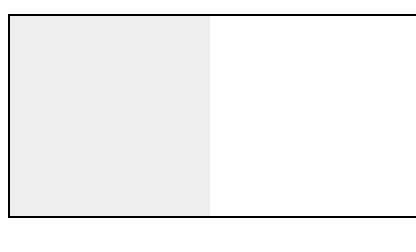

# BFC

## 常见的定位方式

- 普通定位
- 浮动float
- 绝对定位

## 概念

BFC 即 Block Formatting Contexts (块级格式化上下文)，它属于上述定位方案的普通流。
具有 BFC 特性的元素可以看作是隔离了的独立容器，容器里面的元素不会在布局上影响到外面的元素，并且 BFC 具有普通容器所没有的一些特性。

## 触发bfc

- body 根元素
- 浮动元素：float 除 none 以外的值
- 绝对定位元素：position (absolute、fixed)
- display 为 inline-block、table-cells、flex
- overflow 除了 visible 以外的值 (hidden、auto、scroll)

## 特性

### 1、同一个bfc下外边距发生折叠

````html
<head>
div{
    width: 100px;
    height: 100px;
    background: lightblue;
    margin: 100px;
}
</head>
<body>
    <div></div>
    <div></div>
````

上边的第一个`margin-bottom`和第二个的`margin-top`进行了重叠，因为她们都在同一个bfc`body`下

如果要避免，就将他们放到两个不同的容器中，就好像下边的 `container`

````Html
<div class="container">
    <p></p>
</div>
<div class="container">
    <p></p>
</div>
.container {
    overflow: hidden;
}
p {
    width: 100px;
    height: 100px;
    background: lightblue;
    margin: 100px;
}
````

### 2 可以包含浮动元素

我们都知道，浮动的元素会脱离普通文档流，来看下下面一个例子

````html
<div style="border: 1px solid #000;">
    <div style="width: 100px;height: 100px;background: #eee;float: left;"></div>
</div>
````

这个时候外边框就是一条线


但是如果放到bfc中的时候：

````html
<div style="border: 1px solid #000;overflow: hidden">
    <div style="width: 100px;height: 100px;background: #eee;float: left;"></div>
</div>
````



### 3、 防止元素被浮动元素覆盖

先看文字环绕的效果

````html
<div style="height: 100px;width: 100px;float: left;background: lightblue">我是一个左浮动的元素</div>
<div style="width: 200px; height: 200px;background: #eee">我是一个没有设置浮动,
也没有触发 BFC 元素, width: 200px; height:200px; background: #eee;</div>
````


如果设置bfc的话，第二个元素添加overflow：hidden


这个思路可以用于两栏布局
